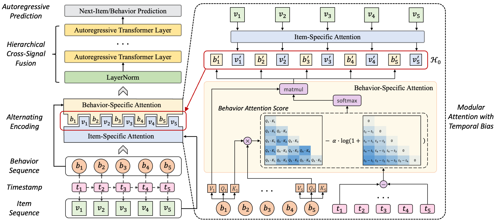

# GEAR: Generalized Alternating Regressor for Multi-Behavior Sequential Recommendation
This is the implementation for the paper "GEAR: Generalized Alternating Regressor for Multi-Behavior Sequential Recommendation".



## Quick Start
0. install pytorch and other dependencies
```bash
pip install -r requirements.txt
```
1. run the model with a `yaml` configuration file like following:
```bash
python run.py --config src/configs/retail.yaml fit 
```

## Dataset
Due to file size limitations, we have not uploaded all of the data. You can download the datasets from [Google Drive](https://drive.google.com/drive/folders/1RxTTZtcjdcK063pkRblRxzVDqVZpZX-R?usp=sharing) and put them into the data/ folder.
